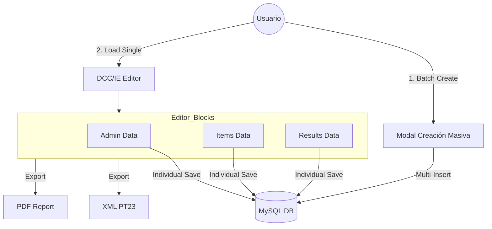
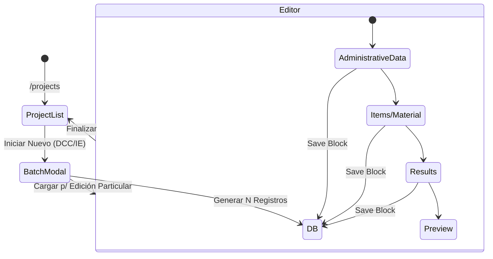

# Documentación Técnica Detallada - Proyecto DCC

Este documento sirve como guía de transferencia de conocimiento para desarrolladores senior que se incorporan al proyecto DCC.

## 1. Resumen Ejecutivo
El proyecto **DCC** automatiza la creación de Certificados de Calibración Digital. Es una herramienta técnica que garantiza el cumplimiento normativo mediante la digitalización estructurada de datos de laboratorio.

## 2. Objetivo de Negocio
Sustituir el flujo manual de certificados en papel por un formato digital (XML/PDF) que asegure la integridad de los datos y facilite la integración con sistemas de gestión de activos de los clientes.

## 3. Arquitectura y Tecnologías
- **Angular 17**: Uso extensivo de Standalone Components y Signals/Observables para reactividad.
- **PHP Backend**: El sistema se comunica con un backend PHP existente que actúa como capa de acceso a datos (DAL).
- **MySQL**: Bases de datos `calibraciones` y `hvtest2`.
- **Integración**: Se integra con el sistema de CRM/Oportunidades corporativo.

## 4. Estructura de Datos (DCCData)
El modelo de datos central se define en `src/app/services/dcc-data.service.ts`. Estructura principal:
- `administrativeData`: Software, laboratorio, cliente, responsables.
- `items`: Lista de objetos calibrados y sub-ítems.
- `results`: Mediciones brutas y procesadas.
- `measurementUncertainty`: Cálculos de incertidumbre expandida.

## 5. Flujos Críticos de Datos y Persistencia

### Modelo de Operación: Creación Batch + Edición Granular
El sistema opera mediante una pre-generación masiva de registros seguida de una edición granular persistente por bloques.

### Flujo de Navegación

Esto garantiza que no se pierdan datos si el usuario cierra la pestaña, ya que cada bloque se consolida en la BD al momento de confirmar la edición parcial.

### Autenticación e Integración
Sesión controlada por parámetros de URL: `?id=[USER_ID]`. Utilizado en el componente `Navbar` para cargar tareas pendientes y trackear el `created_by` en nuevos registros.

### Diferenciación de Negocio (DCC vs IE/IE-D)
-   **DCC (Digital Calibration Certificate)**: Basado en proyectos de calibración (`opportunity_calpro`). Estructura rígida bajo estándar PT23.
-   **IE/IE-D (Informe de Ensayo)**: Basado en proyectos de ingeniería/ensayo (`opportunity`). Incluye lógica adicional para **Material de Prueba** (Tested Material) y gestión de circuitos en el caso de IED (Informes Digitales).

## 6. Variables de Entorno y Configuración
Ubicación: `src/app/shared/models/url.model.ts`
- `URLNuevo`: Backend para oportunidades y tareas.
- `URL`: Backend para datos del certificado.
- `pdfURL`: Servidor de renderizado de reportes.

## 7. Deudas Técnicas y Plan de Mejora
- **Refactorización de Servicios**: Dividir `DccDataService` en submódulos (AdminService, ResultService, XMLService).
- **Configuración Dinámica**: Migrar URLs hardcodeadas a archivos `environment.ts`.
- **Seguridad**: Implementar interceptores con tokens Bearer (JWT) para las peticiones HTTP.
- **Testing**: Incrementar cobertura de unit tests en lógica de cálculos (`.spec.ts` actuales son mínimos).

## 8. Guía de Onboarding
1.  Revisar `app.routes.ts` para entender los puntos de entrada.
2.  Analizar `ApiService` para comprender cómo se estructuran las peticiones a `post.php`.
3.  Familiarizarse con el esquema XML de DCC (ubicado en `services/pt23-xml-generator.service.ts`).
4.  Para depuración, activar `isTesting = true` en `shared/config.ts`.
