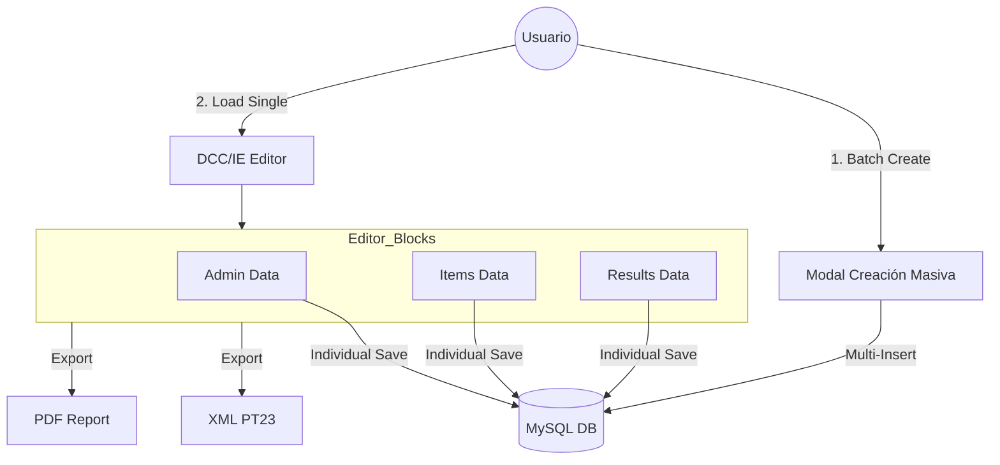
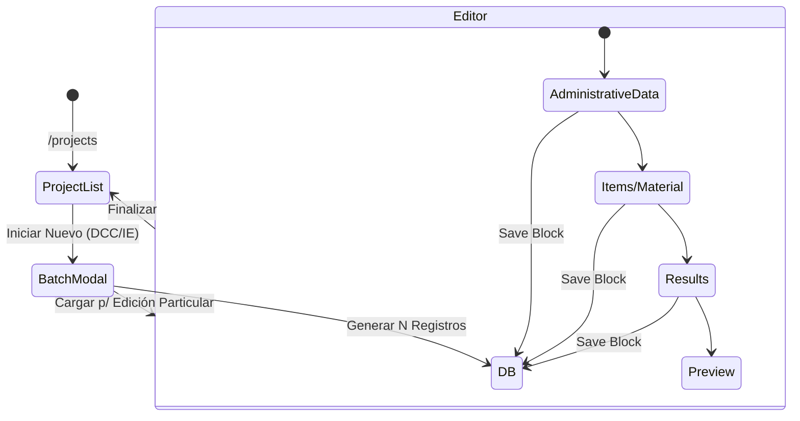

# DCC Generator - Digital Calibration Certificate

Sistema empresarial para la gestión, creación y despacho de certificados de calibración digital (DCC) siguiendo estándares internacionales y cumplimiento de la norma ISO/IEC 17025.

## 🚀 Inicio Rápido

### Requisitos
*   Node.js v18.13+
*   Angular CLI v17
*   Conexión a la red local/VPN corporativa (para acceso a APIs PHP)

### Instalación
```bash
npm install
```

### Ejecución (Desarrollo)
```bash
npm run start
```
La aplicación estará disponible en `http://localhost:4200`.

---

## 🏗️ Arquitectura del Sistema

El sistema opera mediante una pre-generación masiva de registros seguida de una edición granular persistente por bloques.



### Flujo de Navegación



---

## 🛠️ Tecnologías Principales

*   **Frontend**: Angular 17 (Standalone Components), RxJS, TypeScript.
*   **Estilos**: Bootstrap 5, Angular Material.
*   **Backend**: PHP API.
*   **Reportes**: Generación dinámica de XML (estándar PT23) y PDF.
*   **Extras**: Electron (soporte para App de escritorio), ngx-toastr, SweetAlert2.

---

## 📂 Estructura de Carpetas

*   `src/app/Components/`: Componentes modulares (Admin, Items, Results, etc.).
*   `src/app/services/`: Lógica de negocio y comunicación con el backend.
*   `src/app/api/`: Capa base de integración HTTP.
*   `database/`: Scripts SQL para el mantenimiento de la base de datos MySQL.

---

## 📄 Documentación Adicional

Para un análisis técnico detallado, guía de onboarding y deudas técnicas, consulta el archivo:
[DOCUMENTATION_SENIOR.md](./DOCUMENTATION_SENIOR.md)

---

## 👤 Autor
Equipo de Sistemas - MASD - HV Test
